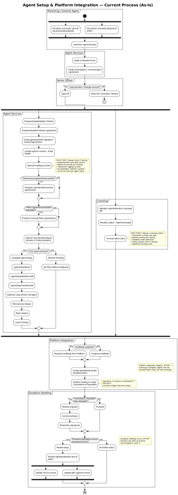
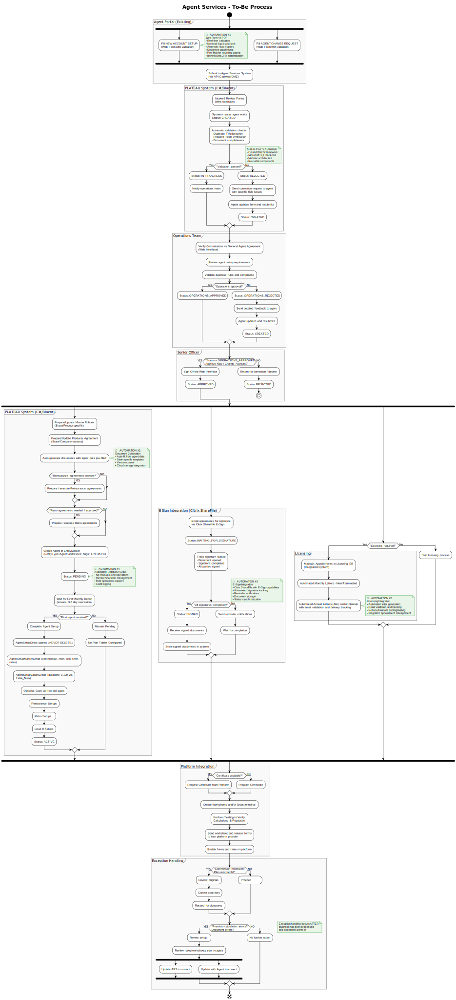
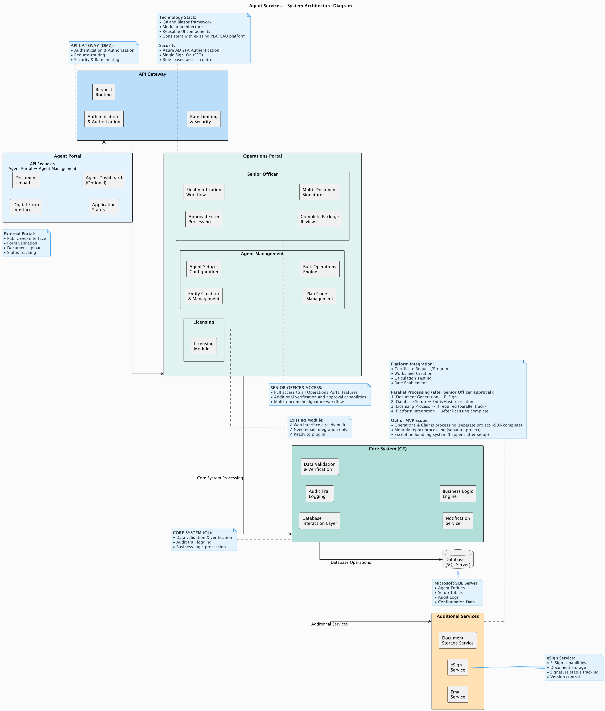

# Agent Services - Project Overview

## 📋 Project Summary

**Project Name:** Agent Services Automation  
**Objective:** Replace legacy Microsoft Access system with modern web interface for agent management and setup processes  
**Current Status:** MVP Scope Clarification Complete  
**Technology Stack:** C# + Blazor (PLATEAU Integration)  
**Timeline:** Q1 2025 (2.5-3 months)  

## 🏢 Business Context

### What is Agent Services?
Agent Services is a department responsible for setting up and managing agents (financial institutions, banks, credit unions) who sell insurance products for the company. These agents are the individual locations that sell insurance products tied to financial transactions (loans, mortgages, etc.).

### Business Model
- **Insurance Type:** Credit insurance primarily
- **Products:** Life, disability, property, auto, and other insurance products tied to financial transactions
- **Premium Structure:** Mostly single premium policies (3 months to 10+ years terms)
- **Agents:** Banks, credit unions, dealerships, finance companies

## 🏗️ Technical Architecture 

### **Existing Infrastructure:**
- **PLATEAU System:** Modern web-based operational system with modular architecture
- **Technology Stack:** C# and Blazor framework with Microsoft SQL backend
- **Agent Portal:** Existing customer-facing portal with Okta 2FA authentication
- **Security:** DMZ separation, API Gateway, application firewalls
- **Document Management:** Citrix ShareFile with E-Sign capabilities

### **Integration Approach:**
- **Not Greenfield:** Agent Services will be built as a new module within existing PLATEAU system
- **Code Consistency:** Maintain C# and Blazor for maintenance purposes
- **UI Kit:** Leverage existing PLATEAU components and styling
- **Role-Based Access:** Individual user roles managed through Okta SSO
- **Modular Design:** Reusable components across different projects

### **Key Technical Decisions:**
- **Framework:** C# and Blazor
- **Authentication:** Okta with two-factor authentication
- **Database:** Microsoft SQL Server (existing)
- **E-Sign:** Citrix ShareFile integration (existing capability)
- **API Security:** Internal APIs with DMZ protection

## 🔄 Current Process (As-Is)

### **Process Flow Diagram:**

*Current process with Operations & Claims as separate project, exception handling after business processing, licensing starts RIGHT BELOW Senior Officer approval and works in parallel with all Agent Services processes. Diagram shows complete workflow with parallel licensing execution and clarified process boundaries.*


### 1. **Initiation Phase**
- **Trigger:** Marketing Rep or General Agent submits forms
- **Two Types of Requests:**
  - **NEW ACCOUNT SETUP** - New agent onboarding
  - **AGENT CHANGE REQUEST** - Modifications to existing agents
- **Form Details:** Fillable PDF containing:
  - Account name, TIN, branch information
  - Loan platform details
  - Products to be offered
  - Commission structures
  - Retro/reinsurance information
  - Terms, limits, and rates

### 2. **Review & Approval**
- **Agent Services:** Intake and review setup form
- **Operations Team:** Verify commissions against General Agent Agreement (Web Interface)
- **Operations Team:** Review agent setup requirements and validate business rules
- **Senior Officer:** Approve or reject new account setup (only after Operations approval)
- **Decision Point:** If rejected, return to Agent Services for corrections

### 3. **Document Preparation**
- **Master Policies:** Prepare state/product-specific policies (fillable PDFs)
- **Producer Agreements:** Create agreements based on state variants
- **Email Process:** Send agreements for signature, receive signed documents

### 4. **System Setup**
- **Access Database:** Create agent in EntityMaster table
  - EntityType = 'Agent'
  - Mailing/physical/claims addresses
  - ACH flag, Licensing flag, TIN, DAT%
  - Licensing contact information
  - Status = PENDING
- **Manual Tracking:** Duplicate data entry in Excel spreadsheet

### 5. **Licensing Process (Optional)**
- **Licensing Specialist:** Maintain appointments in integrated system
- **Automated Monthly Letters:** Send new/terminated appointment notifications
- **Automated Annual Cleanup:** January roster cleanup with email validation and delivery tracking
- **Conditional Process:** Only executed when licensing is required for the agent

### 6. **Platform Integration**
- **Loan Platform Provider:** Receive worksheet and release forms
- **Enable Forms/Rates:** Configure platform for agent's use

### 7. **Final Configuration**
- **Wait Period:** Wait for first monthly report (3-5 day rescission period)
- **Conditional Setup:** Only complete setup after receiving first business
- **Database Configuration:**
  - AgentSetupDirect (plans) - **NEVER DELETE**
  - AgentSetupMasterCredit (commission, reinsurance, risk, term, rates)
  - AgentSetupValuesCredit (durations 0-100 years)
  - Optional: Copy plans from existing agent

### 8. **Operations & Exception Handling**
- **Operations & Claims:** Process business under configured plans (SEPARATE PROJECT)
- **Exception Handling:** Handle commission mismatches AFTER business processing
  - Review originals
  - Correct contracts and re-send for signatures
  - Note: Exception handling occurs after business has been processed and exceptions come in

### 9. **Additional Process Elements**
- **Agent Change Requests:** Handle modifications to existing agent setups
- **Reinsurance Agreements:** Process reinsurance requirements when needed
- **Retro Agreements:** Handle retroactive agreement processing
- **Certificate Management:** Request or program certificates as required
- **Platform Integration:** Create worksheets, perform testing, verify calculations
- **Rate Maintenance:** Handle annual/tri-annual rate changes and state notifications
- **Filing Process:** Manage filing requirements and agent notifications

## ⚠️ Current Pain Points

### **PAIN POINT #1: Manual Excel Tracking**
- **Problem:** Duplicate data entry after Access/document processing
- **Impact:** Time-consuming manual work, prone to errors
- **Desired Solution:** Automatic tracking fed from system

### **PAIN POINT #2: Licensing Letters & Roster Cleanup**
- **Problem:** 
  - Thousands of letters sent manually
  - Outdated email addresses
  - Heavy manual printing/mailing
- **Impact:** Significant time investment, especially during January cleanup
- **Frequency:** Monthly letters + annual cleanup

## 🏢 PLATEAU System Overview

### **What is PLATEAU?**
**PLATEAU** is the company's modern web-based operational system for managing insurance operations. It's a comprehensive corporate platform that handles the core business processes.

### **PLATEAU Architecture:**
```
PLATEAU Dashboard
├── Accounting
├── Agents 
├── Admin
├── Dev
└── Employees
```

### **What Already Works in PLATEAU:**

#### **1. Certificate Management:**
- **Certificate Creation:** Complete forms with borrower, lender, and loan information
- **Certificate Details:** Full certificate information (status, dates, amounts)
- **Lifecycle Management:** Cancel, reissue certificates
- **Bulk Operations:** Mass actions on multiple certificates

#### **2. Reporting System:**
- **Report Creation:** "Create Report" functionality
- **Detailed Reports:** Tabbed interface (Overview, Actions, Cert, Error Check)
- **Financial Reporting:** Transactions, premiums, commissions
- **Search & Filtering:** Multiple criteria search capabilities

#### **3. Financial Module:**
- **Premium Tracking:** ISSUE PREM, CANCEL PREM, NET PREM
- **Commission Management:** RETAIN COM, AGENT REM, LVL2 RET
- **Multi-level Structure:** Agent and Level 2 commissions

#### **4. Interface & Navigation:**
- **Modern Web Interface:** Professional, clean design
- **Authentication System:** User login (e.g., Ammon Manning)
- **Multi-level Navigation:** Home → Certificates → Reports → Plans → Uploads
- **Search Functionality:** By agent, certificate, person, claim

### **Current System Integration:**
```
PLATEAU (Web System) ←→ Access (Legacy Agent Services)
```

## 🛠 Technical Architecture (Current)

### **Legacy Agent Services System:**
- **Database:** Microsoft Access (30-year-old legacy system)
- **Interface:** Access forms (legacy UI)
- **Data Storage:** Normal relational database accessed through old forms
- **Authentication:** Basic Access security

### **Key Database Tables:**
- **EntityMaster:** Stores all account information
- **AgentSetupDirect:** Indicates which plans an agent can sell
- **AgentSetupMasterCredit:** Links agents and plans to commission/reinsurance tables
- **AgentSetupValuesCredit:** Detailed values for different durations (0-100 years)

### **Current Limitations:**
- No modern web interface for Agent Services
- Manual data entry and tracking
- Limited search capabilities
- No automated workflows
- Legacy VBA code mixed with SQL stored procedures
- **Disconnected from PLATEAU:** Agent Services runs separately from main system

## 🎯 Target Process (To-Be)

### **Target Process Flow Diagram:**

*To-Be process with PLATEAU System (C#/Blazor), Agent Portal with Okta 2FA, Citrix ShareFile E-Sign, licensing starts RIGHT BELOW Senior Officer approval and works in parallel with all processes, and clarified exception handling. Diagram shows complete automated workflow with 5 automation points, Operations Team verification, and optional licensing process.*


### **Key Improvements:**

#### **1. Agent Portal Integration:**
- **Existing Portal:** Leverage current customer-facing portal with Okta 2FA
- **Web Forms:** Replace PDF forms with real-time validation
- **API Gateway:** Secure communication via DMZ and API Gateway

#### **2. PLATEAU System Integration:**
- **C# and Blazor:** Built as module within existing PLATEAU system
- **Microsoft SQL:** Direct integration with existing database
- **Modular Architecture:** Reusable components and UI Kit approach
- **Role-Based Access:** Individual user roles through Okta SSO

#### **3. Enhanced E-Sign Process:**
- **Citrix ShareFile:** Leverage existing E-Sign capabilities
- **Automated Tracking:** Signature status monitoring and reminders
- **Document Storage:** Integrated document management

#### **4. Parallel Process Optimization:**
- **Licensing Timing:** Licensing starts RIGHT BELOW Senior Officer approval
- **Parallel Execution:** Licensing works in parallel with ALL Agent Services processes (document preparation, E-Sign, system setup)
- **Independence:** Licensing system and Agent Services processes are not integrated, allowing parallel execution
- **Critical Order:** All processes (including licensing) must complete BEFORE Platform Integration (agent must be licensed before they can start working)

#### **5. Clarified Exception Handling:**
- **Timing:** Exception handling occurs AFTER business processing
- **Separate Project:** Operations & Claims is independent of Agent Services setup
- **Focused Scope:** Agent Services focuses on setup and onboarding only

### **Automation Points (5 Total):**

#### **AUTOMATION #1: Form Validation & Data Entry**
- **Current:** Manual form filling and data entry
- **Target:** Real-time validation, auto-population, error checking
- **Technology:** C# validation rules, database integration

#### **AUTOMATION #2: Operations Team Verification**
- **Current:** Manual commission verification against General Agent Agreement
- **Target:** Automated web interface for Operations Team review
- **Technology:** Web-based verification system with approval workflow

#### **AUTOMATION #3: Document Generation**
- **Current:** Manual PDF creation and email sending
- **Target:** Automated document generation and distribution
- **Technology:** Template-based document generation, automated email system

#### **AUTOMATION #4: E-Signature Process**
- **Current:** Manual signature collection and tracking
- **Target:** Automated E-Sign workflow with Citrix ShareFile
- **Technology:** Citrix ShareFile integration, automated reminders

#### **AUTOMATION #5: System Integration**
- **Current:** Manual platform integration and testing
- **Target:** Automated integration with existing systems
- **Technology:** API integration, automated testing, system validation

## 🏗️ System Architecture

### **Technical Architecture Diagram:**

*Professional system architecture with Symfa color palette - complete infrastructure with API Gateway, Core System (C#/Blazor), and external integrations*

### **Architecture Components:**

#### **🌐 External Layer - Agent Portal**
**Purpose:** Digital interface for agents to submit applications and track status
- **Digital Form Interface:** Web forms with real-time validation (replaces PDF forms)
- **Document Upload:** Secure document submission capabilities
- **Application Status:** Real-time tracking of application progress
- **Agent Dashboard:** Centralized view for agents to manage submissions

**Key Benefits:**
- Eliminates endless email back-and-forth
- 5-minute form completion vs. hours of manual process
- Automatic data validation and duplicate detection
- Auto-population for returning clients

#### **🔒 Security Layer - API Gateway**
**Purpose:** Secure entry point protecting internal systems from external threats
- **Authentication & Authorization:** Two-factor authentication with Okta
- **Security & Rate Limiting:** DMZ separation (leverages existing infrastructure)
- **Request Routing:** Intelligent routing and load balancing
- **API Requests Processing:** Centralized API management

**Security Features:**
- Behind firewalls and application firewalls
- Full DMZ separation between external and internal systems
- Rate limiting to prevent DDoS attacks
- Secure communication protocols

#### **⚙️ Core System (C#/Blazor)**
**Purpose:** Main business logic and processing engine
- **Data Validation & Verification:** Comprehensive data validation rules
- **Entity Creation:** Automated agent record creation
- **Agent Setup:** Complete agent onboarding process
- **Plan Code Management:** State-specific plan configuration
- **Configuration Management:** System-wide configuration control
- **Bulk Operations:** Mass processing capabilities

**Technical Stack:**
- **Framework:** C# and Blazor
- **Database:** Microsoft SQL Server (existing infrastructure)
- **Architecture:** Modular design with reusable components
- **Integration:** Seamless integration with existing PLATEAU system

#### **👥 Operations Layer - Operations Portal**
**Purpose:** Internal management interface for operations team
- **Agent Management:** Complete agent lifecycle management
- **Senior Officer Access:** High-level approval and oversight
- **Multi-Document Workflow:** Streamlined document processing
- **Verification & Approval:** Role-based approval workflows

**User Roles:**
- **Agent Manager:** Day-to-day agent operations
- **Senior Officer:** Final approvals and oversight
- **Licensing Manager:** Licensing process management
- **Role-Based Access:** Each user sees only relevant information

#### **🗄️ Data Layer - Database Operations**
**Purpose:** Secure data storage and management
- **Audit Trail Logging:** Complete audit trail of all changes
- **Data Validation:** Database-level validation rules
- **Notification Service:** Automated notification system
- **Database Interaction Layer:** Secure database access

**Database Structure:**
- **Existing Tables:** EntityMaster, AgentSetupDirect, MasterCredit, ValuesCredit
- **Maintained Relationships:** Preserves current table relationships
- **Automated Operations:** C# code handles all database operations
- **Complete Audit:** Every change tracked and logged

#### **🔌 External Services Integration**
**Purpose:** Integration with existing enterprise services
- **Email Service Provider:** Automated email notifications
- **eSign Service (Citrix ShareFile):** Electronic signature capabilities
- **Document Storage Service:** Secure document management
- **Template Management:** Automated document generation

**Integration Benefits:**
- **Citrix ShareFile:** Leverages existing E-Sign capabilities
- **Email Automation:** Reduces manual communication
- **Document Storage:** Centralized document management
- **Template System:** Automated document generation

### **Key Architectural Decisions:**

#### **1. Modular Integration Approach:**
- **PLATEAU Integration:** Built as module within existing PLATEAU system
- **UI Kit Reuse:** Leverages existing UI components and styles
- **Consistent Technology:** C#/Blazor maintains technology consistency
- **Maintenance Efficiency:** No need for additional developer training

#### **2. Security-First Design:**
- **DMZ Architecture:** Utilizes existing DMZ infrastructure
- **Okta Integration:** Two-factor authentication for all users
- **API Gateway:** Centralized security and rate limiting
- **Role-Based Access:** Granular permission system

#### **3. Scalability Considerations:**
- **Modular Architecture:** Easy to extend and modify
- **Reusable Components:** Reduces development time
- **Database Optimization:** Efficient data operations
- **External Service Integration:** Flexible service integration

## 🎯 Project Goals (To-Be) 

### **Primary Objectives:**
1. **Eliminate Manual Excel Copy-Paste:** Replace Terry's manual Ctrl-C, Ctrl-V operations with automated C# operations
2. **Automate Complex Table Relationships:** Handle EntityMaster → AgentSetupDirect → MasterCredit → ValuesCredit relationships automatically
3. **Add Comprehensive Audit Logging:** Track all changes at EntityMaster level (agreed approach by team)
4. **Create Hierarchical Navigation:** Drill-down interface from EntityMaster to related tables
5. **Integrate with PLATEAU:** Build Agent Services as module within existing PLATEAU system
6. **Maintain Database Structure:** Keep existing table relationships, automate operations through C# code

## 📊 Process Metrics

### **Current Performance:**
- **Setup Time:** 30 minutes (simple) to 1 hour (complex)
- **Error Rate:** Manual process prone to human error
- **Volume:** Multiple agents setup per day
- **Dependencies:** Operations and Claims depend on Agent Services setup

### **Success Criteria:**
- Reduce setup time
- Eliminate manual tracking
- Improve data accuracy
- Streamline licensing processes
- Better audit trail

---


